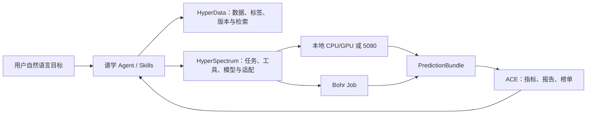

# HyperSpectrum：通用科学谱学运行时与 XAS Agent 首期设计

日期：2026-08-08

状态：已完成对话评审，待书面审阅

首期范围：XAS Agent 完整垂直链路

## 1. 决策摘要

新建独立仓库 `hyper-instrument/hyper-spectrum`，Python 包名使用
`hyperspectrum`。项目定位不是单一的一维光谱模型库，而是面向 XAS、质谱、
核磁、EELS、Raman、FTIR、UV-Vis 和高光谱等科学谱学与谱成像任务的通用模型、
工具及少样本适配运行时。

HyperSpectrum 采用“薄内核 + 领域插件 + 声明式工具清单”架构。首期只要求
XAS 真实端到端跑通；高光谱作为第二条真实链路，MS、NMR、EELS 首期只要求
合同和 smoke adapter 成立。首期 XAS 验收不是一条人工拼接的脚本，而是 Agent
能够从自然语言需求出发，完成数据发现、任务判断、工具选择、资源调度、定量评测、
问题解释、少样本派生和榜单更新。

三个既有系统的边界保持不变：

| 系统 | 职责 | 不承担的职责 |
| --- | --- | --- |
| HyperData | 数据集、版本、文件、标签、权限、检索、解析证据与资产交付 | 模型运行时和正式评测榜单 |
| HyperSpectrum | 谱学数据适配、科研工具、模型加载、预测和少样本适配 | 平台数据目录、调度器和排行榜 |
| ACE Benchmark | Task/Board、确定性划分、执行后端、指标、报告与榜单 | 领域模型实现和数据平台 |

本地 CPU/GPU、5090 和 Bohr Job 必须消费同一份任务、工具与产物合同。不能为
Bohr 另写一条不可复现的业务链路。

## 2. 目标与非目标

### 2.1 目标

1. 让 Agent 能根据数据描述、元信息、文件内容和标签证据判断可做的谱学 AI 任务。
2. 让传统科研软件、经典算法、预训练模型和少样本训练器使用同一种发现与运行协议。
3. 支持本地 Python、本地容器、远程 5090 和 Bohr Job，并记录完全一致的运行谱系。
4. 将预测、定量指标、图表、失败样品和派生权重交给 ACE 形成可更新榜单。
5. 新领域和新工具可以通过插件与 `tool.yaml` 增量加入，不修改核心分发逻辑。

### 2.2 非目标

1. HyperSpectrum 不替代 HyperData 的数据目录或复制一套 SQLite 数据注册表。
2. HyperSpectrum 不替代 ACE 的运行后端、报告和榜单模型。
3. 首期不要求 MS、NMR、EELS、高光谱全部完成正式科研榜单。
4. 首期不进行大规模从头训练；默认使用固定权重、传统基线和 one-shot/few-shot
   adapter、LoRA、线性头或校准层。
5. 无标签、无明确代理真值或划分不可信的数据不得进入定量榜单。

## 3. 现状与可复用证据

### 3.1 现有 HyperXAS

现有 `hyper-instrument/hyper-xas` 包含结构到 XAS、CycleGAN 域适配、XAS 到
LDOS 等代码，但数据接口固定为 `spectrum.npz + structure.json`、200 点 XANES
网格和硬编码边类型。其数据集、训练器和评测接口之间还有 LDOS 字段与划分合同不一致
等问题，不适合作为通用谱学内核。可以将已验证的模型逻辑迁成 HyperSpectrum XAS
插件，但不保留第二套数据目录或硬编码数据划分。

### 3.2 Even-Ma/xas

`Even-Ma/xas` 是在 5090 `myw` 用户环境中形成的阶段化 XAS 复现工作区，覆盖
Larch/Athena、XASDenoise、FeatureXAS、OmniXAS、DeepFit、pyxas 和
DeepONet 等项目。当前明确跑通的是 XASDenoise 固定权重推理及传统基线；若干其他
项目因权重或数据下载不完整处于 blocked。

该仓库当前没有明确许可证声明，因此首期把它作为固定 commit 的外部工具集合接入，
不直接复制或重新分发无许可代码。每个上游项目必须拆成独立工具清单和状态，不能用一个
“xas”大工具掩盖某个模型缺权重或不可执行。

### 3.3 HyperData 与火山数据

既有审计显示 HyperData 曾检索到多批 XAS/XANES/EXAFS 数据与文件，也存在
XAS parser、schema、预览和训练 bundle 参考实现。用户确认火山 HyperData 已入库
大量 XAS 数据。当前从 5090 可访问的数据库实例没有暴露 XAS modality 关联，HTTP
入口也存在超时，因此首个真实任务必须先确认正确的生产实例、租户和检索入口，并验证
已入库记录能够被 Agent 找到。

这项差异是可观测的接入门禁，而不是“数据不存在”的结论。Agent 搜索不能只依赖
modality facet，还必须联合标题/摘要语义、XAS/XANES/EXAFS 术语、文件类型、
能量轴和吸收边等文件内容证据。

`zenodo-17434349` 是首个优先候选，因为现有复现中它支持 XAS 去噪的定量分析，
但代码不得写死该 ID。最终选择必须来自在线 HyperData 查询和数据证据审计。

### 3.4 ACE 与 Bohr

ACE Benchmark 已提供 research match/import/build/run/report/runs、研究镜像薄
adapter、本地 Docker 与 Bohr Job 后端。Bohr 不支持本地 bind mount，因此 adapter、
数据和权重必须暂存上传；外部镜像可在运行时注入 adapter。Bohr 提交使用镜像 tag，
但结果必须记录本地解析到的镜像 digest、adapter digest、数据摘要和权重摘要。

## 4. 总体架构



HyperSpectrum 内核只定义稳定合同和注册机制。领域插件负责解释科学含义，工具插件
负责执行，ACE 负责调度与评分。任何插件都不能根据数组维数猜测物理轴，也不能绕过
TaskSpec 自行选择测试集。

## 5. 数据与任务合同

### 5.1 ObservationBundle

通用数据单元命名为 `ObservationBundle`，而不是 `SpectrumSample`。Bundle 只保存
清单和对象引用，大数组仍位于 HyperData/对象存储中的 Zarr、HDF5、Parquet、NPZ
等资产。

```yaml
schema_version: hyperspectrum-observation/v1
sample_id: sample-001
modality: xas
artifacts:
  - role: raw_signal
    kind: dense_array
    uri: hyperdata://dataset/version/file
    axes:
      - name: energy
        unit: eV
  - role: ground_truth
    kind: dense_array
    uri: hyperdata://dataset/version/reference
context:
  sample: {}
  instrument: {}
  acquisition: {}
labels: {}
provenance: {}
```

基础 artifact kind 包括 dense array、peak table、image、mask、region、structure、
graph、scalar、class、multilabel、distribution 和 metadata。每个轴必须声明名称、
单位、方向和坐标；HSI 三维数组不能因形状而自动推断 wavelength 轴。

### 5.2 TaskSpec

`TaskSpec` 定义输入角色、输出 schema、标签要求、数据划分、泄漏检查、指标、聚合
方法和资源约束。首批任务族包括预处理/校准、分类、回归、去噪/重建、峰识别、匹配/
检索、解混/反卷积、分割/检测/异常、正向模拟和逆向推断。

### 5.3 PredictionBundle

每次运行输出 `PredictionBundle`，至少包含：

- 与输入样品一一对应的预测和状态；
- 任务领域所需的坐标轴与单位；
- 失败样品及错误类型；
- 模型、工具、权重、数据和运行环境摘要；
- 供 ACE 读取的产物清单。

正式评分由 ACE 根据 TaskSpec 和 ground truth 执行。模型容器不能自行隐藏失败样品、
更改测试集或只上报有利子集。

## 6. 插件与动态工具协议

每个领域可注册 `DataAdapter`、`ToolPlugin`、`ModelPlugin` 和可选的
`TrainerPlugin`。统一生命周期为：

```text
probe -> prepare -> verify -> predict/adapt -> evaluate -> export
```

传统数值拟合与神经网络训练必须分开记录。LCF/PCA 的运行时优化不标为模型训练；
LoRA、adapter 或线性头需要记录初始化权重、训练样本、更新参数和派生权重。

工具通过 `tool.yaml` 注册：

```yaml
schema_version: hyperspectrum-tool/v1
id: xasdenoise
version: pinned-commit-or-release
modalities: [xas]
tasks: [denoising]
runtime:
  kind: python
  image: registry.example/xasdenoise:tag
entrypoint: adapters/xasdenoise/run.py
inputs: []
outputs: []
resources:
  cpu: 4
  memory_gb: 16
  gpu: optional
verify: []
source: https://example/repository
license: unknown
```

动态注册必须经过以下门禁：固定源码 commit 或镜像版本；验证资产摘要；声明许可；
probe/verify 通过；输入输出与 TaskSpec 匹配；资源需求可满足；默认 dry-run；禁止静默
下载未知权重或启动大规模训练。许可未知的工具可以私有验证，但不能被开源发行包重新分发。

## 7. XAS 首期 Agent 故事

### 7.1 用户入口

用户只需提出：

> 从 HyperData 找一个能做定量评测的 XAS 数据集，用已有模型评测；发现问题后做
> one-shot/few-shot 适配，并更新榜单。

### 7.2 Agent 决策链

1. **发现数据。** Agent 在配置的 HyperData Hub/租户中，联合模态、术语、文件格式、
   文件内容、标签、许可和访问状态检索候选数据集。
2. **生成画像。** 只抽取小样本/header 检查能量轴、单位、元素、吸收边、采样网格、
   重复样品、标签来源和异常值，不在选型阶段下载全量数据。
3. **推断任务。** noisy/clean 或重复扫描/平均谱配对可形成去噪任务；结构-谱配对可
   形成正向预测；氧化态/配位标签可形成分类；只有无标签谱时只能推理和可视化。
4. **验证可评分性。** 明确 ground truth 或代理真值的来源和限制，按化合物/样品/
   acquisition 分组生成确定性 split，禁止相邻扫描或同一样品跨 split。
5. **发现工具。** 匹配传统基线、Larch 下游工具和固定权重模型，检查工具许可、权重
   摘要、支持域及可执行状态。
6. **生成计划。** 根据数据位置、镜像、GPU、队列和用户策略选择本地/5090 或 Bohr，
   先输出 dry-run 计划和不可逆操作。
7. **执行与回收。** HyperData 固定数据版本，HyperSpectrum adapter 生成预测，ACE
   计算指标并回收日志、图表和失败样品。
8. **解释结果。** Agent 同时解释谱值指标和下游化学指标，不能把 RMSE 改善直接表述
   为科学任务改善。
9. **少样本派生。** 经用户确认后，按组选择 one-shot 或 5/10-shot，冻结主干，仅训练
   小型 LoRA/adapter/线性头/校准层；原测试集不参与选择和调参。
10. **更新榜单。** zero-shot、one-shot 和 few-shot 作为不同 model variant，保留完整
    谱系并更新 ACE Board。

### 7.3 分支与拒绝行为

- 无标签或代理真值不可信：输出 inference-only 报告，不进入榜单。
- modality facet 缺失：使用语义和文件证据继续召回，同时提出元数据修复建议。
- 数据服务不可用：报告连接阻塞，不把旧缓存冒充在线结果。
- 权重缺失或校验失败：模型状态为 blocked，不允许随机初始化替代。
- 许可未知：允许受限环境验证，不复制源码或公开镜像。
- 本地资源不足：提出 Bohr 计划；Bohr 不可用时保留计划，不伪造运行结果。

## 8. XAS 首个定量 Board

首个 Board 暂定为 `XAS Denoising`。优先候选是经 HyperData 在线验证的
`zenodo-17434349`；若在线画像证明另一个数据集标签和分组更可靠，Agent 可自动推荐
替换，但需要把选择理由写入 TaskSpec。

首批比较对象：

| 类别 | 变体 | 训练策略 |
| --- | --- | --- |
| 传统基线 | Savitzky-Golay、Gaussian、移动平均、PCA | 无训练或运行时拟合 |
| 概率方法 | Gaussian Process | 运行时优化，单独标注 |
| 固定权重 | XASDenoise autoencoder | zero-shot，权重不变 |
| 派生模型 | adapter/LoRA/校准层 | one-shot 或 few-shot |

主榜的 primary metric 定为按化合物分组聚合的 mean normalized spectrum RMSE，
方向为 minimize。置信区间使用化合物分组 bootstrap；逐样品结果和分组分布必须同时
保留。其他指标作为 secondary metrics，不得在报告生成时临时更换主指标。

指标分为三个层次：

| 层次 | 指标 | 方向 |
| --- | --- | --- |
| 谱值 | RMSE、MAE、cosine similarity、derivative RMSE | 按指标定义 |
| 谱学特征 | edge-position error、white-line position/height error | 越低越好 |
| 下游科学任务 | LCF weight MAE（仅适用子轨道）、失败率 | 越低越好 |

Board 必须显示逐样品分布、置信区间和失败案例，不能只展示平均值。使用 time-average
等代理参考时，报告和榜单必须明确写“proxy ground truth”，不能称为独立无噪声真值。
LCF weight MAE 只在存在已知混合比例或可靠组分标签的数据上启用，作为独立下游诊断
子轨道；它不能用缺少组分真值的普通去噪样品计算，也不能与去噪主榜混排。

## 9. 本地与 Bohr 执行

HyperSpectrum 对 ACE 暴露一个薄 adapter：

```text
run.py --data /data --weights /weights --task task.yaml \
       --max-samples N --out /out
```

输出至少包含 ACE 兼容的 `metrics.json`、`predictions/`、`artifacts.json` 和
`run-manifest.json`。本地与 Bohr 只替换执行后端，不替换业务参数或数据合同。

本地路径适合数据已经在 5090 或用户本地 GPU 的场景。Bohr 路径由 ACE 暂存 adapter、
数据与权重，选择命名 GPU SKU，提交任务，轮询状态并选择性回收输出。运行记录保存：

- HyperData dataset/version 与文件摘要；
- TaskSpec、split manifest 和 evaluator 版本；
- 工具源码 commit、adapter digest、镜像 tag/digest；
- 权重来源和摘要；
- 后端、机器类型、耗时、退出码和日志；
- 预测、指标、图表与失败样品。

## 10. Agent 接口

仓库提供可供 Codex/Claude 等 Agent 调用的稳定 CLI 和 Skills。首期命令面建议为：

```text
hyperspectrum data search
hyperspectrum data profile
hyperspectrum task recommend
hyperspectrum tools list|inspect|validate|register
hyperspectrum plan
hyperspectrum run
hyperspectrum adapt
hyperspectrum export
```

所有命令支持 `--json`，stdout 只输出机器可读结果，进度和告警写 stderr。返回状态区分
成功、无结果/下游失败和执行前拒绝。Skills 只编排这些稳定命令，不读取内部 Python 实现。

建议首批 Skills：

- `find-spectroscopy-dataset`：从自然语言目标检索并画像 HyperData 数据；
- `recommend-spectroscopy-task`：判断任务、标签和可评分性；
- `onboard-spectroscopy-tool`：生成和验证工具清单与薄 adapter；
- `run-spectroscopy-benchmark`：选择本地/Bohr 并调用 ACE；
- `adapt-spectroscopy-model`：生成 one-shot/few-shot 派生模型；
- `explain-spectroscopy-report`：解释指标、失败案例和科学限制。

## 11. 仓库结构

```text
hyper-spectrum/
  src/hyperspectrum/
    contracts/
    registry/
    agent/
    execution/
    plugins/
      xas/
      hsi/
      mass_spec/
      nmr/
      eels/
  adapters/
  tools/
  skills/
  schemas/
  tests/
    contract/
    plugins/xas/
    integration/
    e2e/
  docs/
```

XAS 插件不得把领域固定值放进核心合同。其他模态应该能够在不修改 `contracts/` 与
ACE 执行逻辑的情况下注册新的 axes、artifact roles、任务、指标和工具。

## 12. 里程碑与验收

### M0：数据发现与合同

- 连接正确的火山 HyperData 实例/租户；
- 至少发现一批已入库 XAS 数据并生成真实查询证据；
- 对首个候选生成 ObservationBundle、标签审计和确定性 split；
- 无标签候选被正确拒绝评分。

### M1：XAS zero-shot 完整链路

- 注册传统基线、Larch 下游工具和 XASDenoise 固定权重 adapter；
- 在 5090 本地容器完成真实数据运行；
- 使用相同 TaskSpec 和 adapter 完成一次 Bohr Job；
- ACE 生成 XAS Denoising Board、报告、逐样品指标和失败样品；
- 本地与 Bohr 的确定性结果在声明容差内一致。

### M2：少样本更新榜单

- 支持 one-shot 与 5/10-shot 分组采样；
- 只更新明确声明的小型参数集合；
- 派生权重、样本清单与父模型谱系完整；
- zero-shot、one-shot、few-shot 作为独立 variant 更新榜单。

### M3：通用性证明

- 接入第二个 XAS 数据集，代码中无数据集 ID 特判；
- 接入一条高光谱真实任务；
- MS、NMR、EELS 各有一个合同测试与 smoke adapter；
- Agent 能动态注册一个新的外部 Bohr 工具而不修改核心代码。

## 13. 设计验收标准

1. 用户只给自然语言目标，Agent 可以完整走到报告或给出具体阻塞原因。
2. 数据集、任务、模型和后端均通过声明选择，不在代码中写死专有名称。
3. 没有可信标签时不会生成定量分数或榜单条目。
4. 模型权重、代码、镜像、数据、划分、指标和运行环境均可追溯。
5. 本地 GPU 和 Bohr 的业务合同完全一致。
6. 失败样品和负结果不会被丢弃。
7. one-shot/few-shot 不会静默扩展为大规模训练。
8. 未知许可的外部代码不会被复制进开源发行物。
9. 更换 XAS 数据集或新增领域插件不要求修改核心执行器。

## 14. 实施前必须关闭的外部问题

1. 确认火山 HyperData 正确的 API、租户/组织和 Agent 凭证，解释当前 5090 可访问
   数据库未暴露 XAS modality 的原因。
2. 从在线 Hub 返回中锁定首个数据集版本、文件清单、许可、标签/代理真值和对象存储
   交付路径。
3. 确认 XASDenoise 权重的合法来源、摘要和可分发边界。
4. 明确 `Even-Ma/xas` 仓库及各上游项目的许可证，决定哪些内容只能用 adapter 引用。
5. 确认 Bohr 项目 ID、GPU machine type、镜像仓库权限和数据暂存额度。

这些问题不阻塞仓库骨架和合同测试，但在宣称“真实 XAS 榜单已跑通”之前必须全部关闭。
